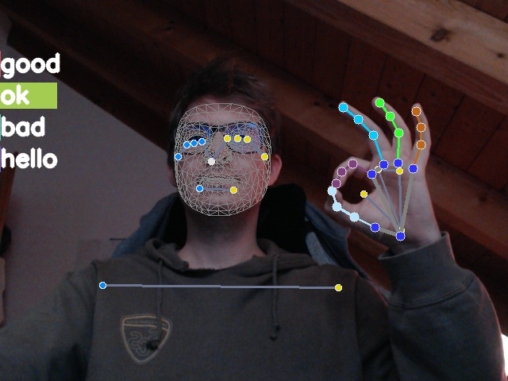
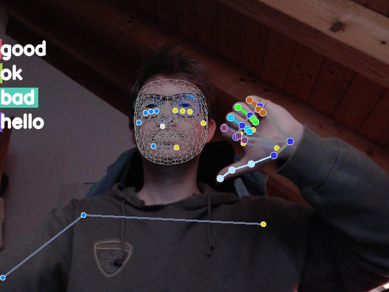

# deep-gesture

An LSTM gesture-recognition neural net which can be trained to
categorize any number of given gestures.

Key features:

-   easy to train
-   uses MediaPipe to generate a Holistic model for compact data collection
-   a custom TensorFlow LSTM neural net

## Requirements

-   numpy
-   scipy
-   matplotlib
-   opencv-python
-   mediapipe
-   sklearn
-   tensorflow
-   tensorflow-gpu

## Install

Soon, you'll simply be able to type `pip install deep_gesture`.

To install from source, you may type

    pipenv install --dev
    pipenv install -e .

## Usage

For more information type

    [pipenv run] deep_gesture -h

Run `deep_gesture` in collection mode (use webcam for data collection):

    [pipenv run] deep_gesture --collect --device 0 --gestures hello --sequences 20 --length 30

Run `deep_gesture` to train a model on collected data:

    [pipenv run] deep_gesture --train --optimizer Adam --lr 0.0001 --epochs 1000 --batch-size 16

Run `deep_gesture` in streaming mode (use webcam for real-time gesture recognition):

    [pipenv run] deep_gesture --device 0

(Not yet implemented) Run `deep_gesture` in file mode (use video file to categorize a gesture):

    [pipenv run] deep_gesture --file example.mp4

(Not yet implemented) Run `deep_gesture` in test-mode:

    [pipenv run] deep_gesture -t

(not yet implemented) or with `pytest`:

    [pipenv run] pytest -v --cov=deep_gesture --cov-report=html

